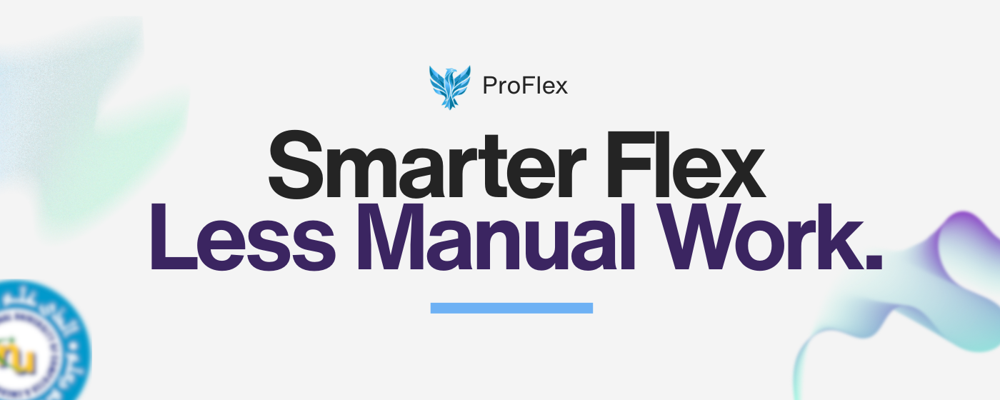
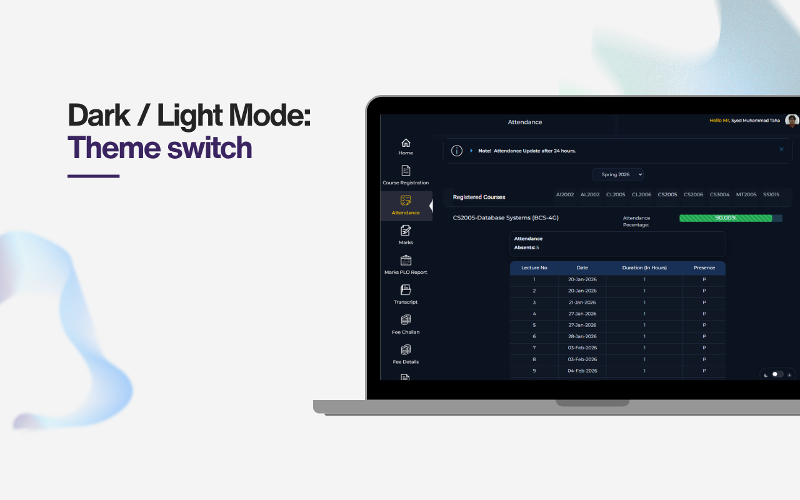
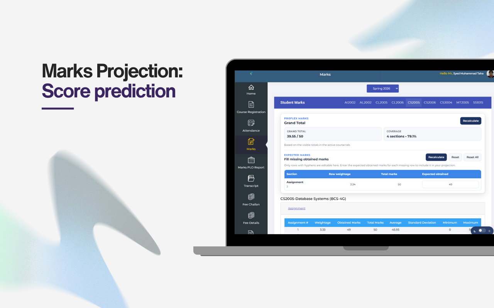
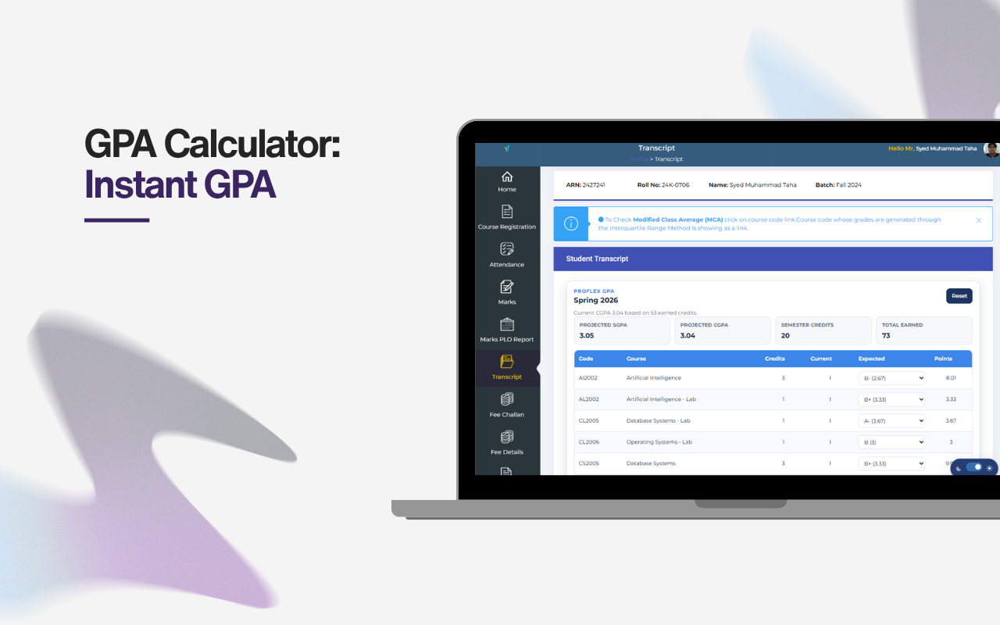
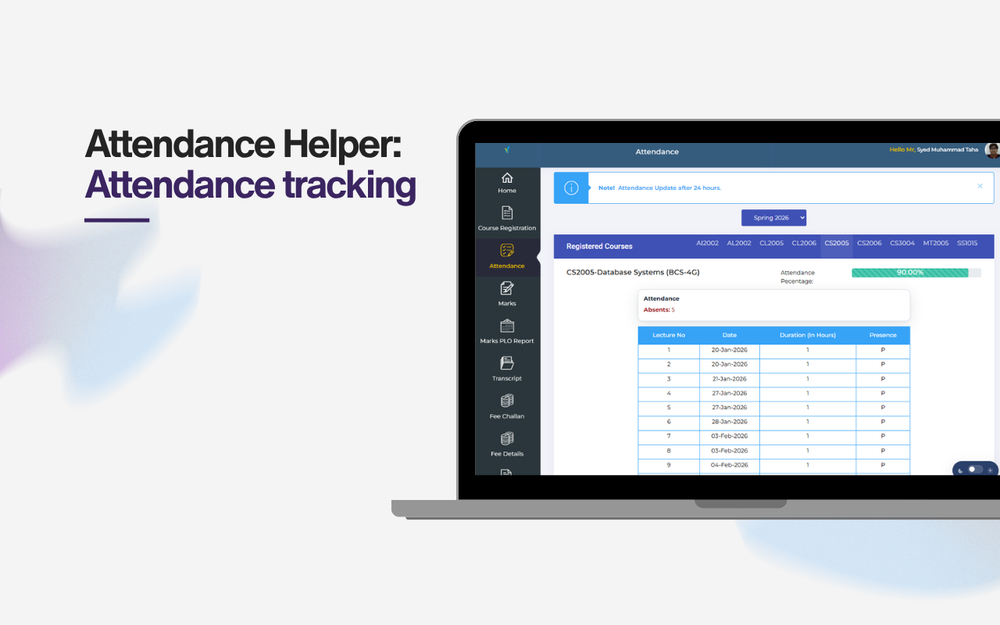

## ProFlex

ProFlex is a small Chrome extension (Manifest V3) that adds lightweight productivity helpers to the FlexStudent portal pages. It is intended for local use to improve convenience when viewing marks, filling course feedback, and previewing GPA changes.

## Features

- Theme Toggle: switch between light and dark mode with local persistence.
- Feedback Auto-Fill: quickly populate the Course Feedback page.
- Marks Projection: edit expected marks and preview the impact on the Student Marks page.
- Transcript GPA Calculator: preview GPA changes on the Transcript page.
- Compact Popup: open portal pages quickly and send optional feedback.

## Screenshots

### Dark Theme

### Marks Prediction

### GPA Calculator

### Attendance

## Privacy & Data Handling

- ProFlex stores only small convenience data locally in the browser: theme preference, expected marks, and transcript grade selections. No telemetry or analytics are collected.
- The extension does not upload your portal data anywhere automatically. Feedback stays local in this build.

## Installation
1. Open Chrome and go to `chrome://extensions`
2. Enable Developer mode
3. Click "Load unpacked"
4. Select the ProFlex folder (the folder containing `manifest.json`)

## Permissions
- Host match: `*://flexstudent.nu.edu.pk/*`

## Notes
- The student report feature is not included in this build.
- ProFlex is not affiliated with or endorsed by FAST / NUCES. If the portal HTML changes, some selectors may need updates.

## License
See `LICENSE`.
